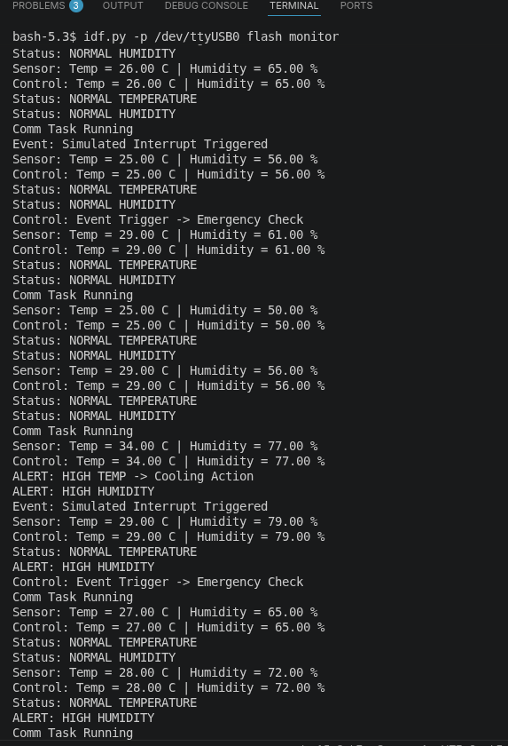
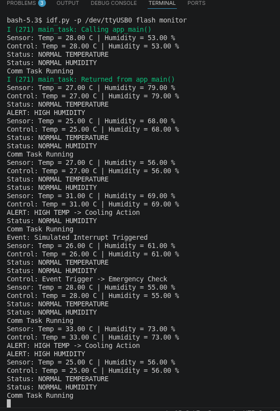
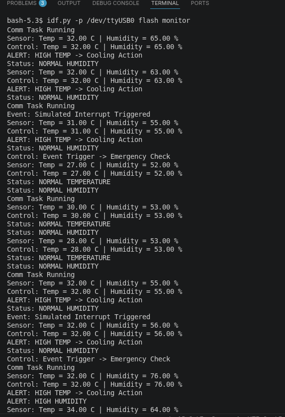

# 🚀 RTOS-Based Thermal & Humidity Monitoring System (ESP32)

<div align="center">


**A simulation-first real-time environmental monitoring firmware architecture using FreeRTOS queues, semaphores, and event-driven control logic.**

</div>

---

## ✨ Project Highlights

* ⚡ **4 FreeRTOS tasks** with priority-based scheduling
* 🔄 **Queue-based sensor packet transfer**
* 🚨 **Semaphore-driven emergency event signaling**
* 🌡️ **Thermal threshold cooling logic**
* 💧 **Humidity threshold alert logic**
* 📡 **Communication heartbeat diagnostics**
* 🧩 **Scalable migration path to KY-015 (DHT11)**

---

## 🖼️ Visual System Architecture

<div align="center">

</div>

---

## 🎞️ Live Execution Snapshots

### 🟢 System Startup & Monitoring Pipeline

<div align="center">

</div>

### 🌡️💧 Thermal + Humidity Alert Flow

<div align="center">

</div>

### ❄️ Threshold-Based Cooling Response

<div align="center">

</div>

---

## 📸 What the Output Proves

### 🌡️ Thermal Safety Logic

* **Temp > 30°C** → Cooling action
* **Temp ≤ 30°C** → Normal state

### 💧 Humidity Monitoring

* **Humidity > 70%** → Alert condition
* **Humidity ≤ 70%** → Normal humidity

### 🚨 Emergency Event

* Simulated every **5 seconds**
* Signals control task through **binary semaphore**
* Triggers **emergency check path**

---

## 🛠️ Tech Stack

```text
ESP32 + ESP-IDF + FreeRTOS + C + Queue + Semaphore + Event-driven design
```

---

## 🎯 Outcome of Project

This project replicates the same RTOS architecture used in:

* 🏭 Industrial environmental panels
* 🔋 Battery thermal safety systems
* 🖥️ Server room HVAC monitoring
* 🌐 IoT sensing nodes
* 🚗 Automotive thermal control subsystems

The visible output may look simple, but the **architecture demonstrates production-grade RTOS design principles**.

---

## 👨‍💻 Author

**Siddarth S**
Embedded Systems • RTOS • ESP32 • Firmware Development
